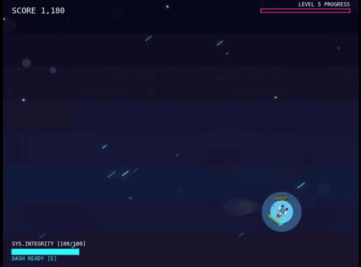

# Vibe

**A space shooter where every enemy is an instrument.**

Enemies attack on the beat, and each type plays a different part of the drum kit. The longer you survive, the more of them join, and the fight turns into the soundtrack.

**[Play it in the browser](https://edwardfalk.github.io/vibe/)**. It needs a computer with a keyboard and mouse. Turn the sound on.



## Controls

| Key                   | Action                  |
| --------------------- | ----------------------- |
| WASD                  | move                    |
| Mouse / arrow keys    | aim                     |
| Click / Space / Shift | shoot                   |
| E                     | dash                    |
| P / M                 | pause / mute            |
| R                     | restart after game over |

## How the music works

Every sound an enemy makes is timed to one shared clock, so together they play a beat:

| Who     | When                                                                  | Plays like      |
| ------- | --------------------------------------------------------------------- | --------------- |
| Player  | held fire snaps to eighth notes; the first shot of a burst is instant | hi-hat          |
| Grunt   | fires on beats 2 and 4                                                | snare           |
| Tank    | fires on beat 1                                                       | kick            |
| Stabber | lunges on the "and" of 3                                              | off-beat accent |
| Rusher  | explodes on beats 1 and 3                                             | crash           |

- **You** are the Dude, in a bathrobe with a White Russian, looking for his carpet. He walks on your hi-hat's eighth notes, and the more they hurt him, the less he abides.
- **Grunts** keep their distance, stepping back when you get close and advancing when you run.
- **Stabbers** wind up, flash a warning, then dash at you.
- **Rushers** are stuntmen on rockets who steer only on the beat: dash aside and they shoot past. Shot or too close, they light, count down on the beat and blow up with a crash on beat 1 or 3, taking anything near with them, other rushers included. Your shots knock them along, so bat one into a crowd.
- **Tanks** are big, slow bouncers who turn only on the kick. Their armour is on the side facing you and their back is bare: get behind one to plant your time bomb, which counts down on the beat and kills him. Stand in front of one and he shoves you.
- **Everyone talks.** Enemies shout lines like "KILL HUMAN!" and "SLICE AND DICE!" through the browser's speech synthesis, and the mix dips the game under them so they're heard.

A steady kick drum and a sub-bass pulse keep time underneath. Without them, the enemies' hits are just sounds. With them, you can hear each hit landing on the beat.

The clock ([`BeatClock`](js/audio/BeatClock.js)) runs on the Web Audio clock (`AudioContext.currentTime`), not on frame time. The kick ([`BeatTrack`](js/audio/BeatTrack.js)) is scheduled slightly ahead on the same grid, so frame hiccups don't push it off the beat.

New enemy types join as you level up: grunts from the start, then stabbers at level 2, rushers at level 3 and tanks at level 5. Halfway through the level before each one arrives, a single enemy of that type appears as a preview.

## Tuning

Open the game with [`?tune`](https://edwardfalk.github.io/vibe/?tune) in the URL for a panel of live sliders:

- the kick's sound: pitch, decay, drive and click;
- the sky: how hard the kick hits it, the downbeat's front, its timing against your speakers, and a preview of each level's sky;
- the mix: effects, beat and speech levels, and how far the game dips under speech;
- pacing: level thresholds, time between enemy waves, and how many enemies can be on screen.

There's also a **Level +1** button. A run that used it can't set a high score. The panel shows the current values as JSON, ready to paste into [`js/config.js`](js/config.js), where every setting lives.

The [voice playground](https://edwardfalk.github.io/vibe/voices.html) is for the speakers' new voices. Type any phrase, pick a speaker, and change its engine (SAM or espeak-ng), its voice and its effect chain. "Copy config" gives you the settings for `js/config.js`. The game itself switches to these voices in the next update.

## Tech

- [p5.js](https://p5js.org/) in instance mode for drawing, a WebGL shader for the sky, Web Audio for sound, and the Speech Synthesis API for voices.
- Plain ES modules with no build step, served as static files on GitHub Pages.
- Unit tests with [Vitest](https://vitest.dev/), and browser tests with [Playwright](https://playwright.dev/), including checks that the kick and enemy shots land on the beat. GitHub Actions runs lint and all tests on every pull request and every push to main.

For how the code fits together, see [ARCHITECTURE.md](ARCHITECTURE.md). The game design is in [docs/DESIGN.md](docs/DESIGN.md), and the tests are described in [docs/TESTING.md](docs/TESTING.md).

## Run it locally

```bash
pnpm install
pnpm run dev        # http://localhost:5500
pnpm run test       # browser tests, then unit tests
pnpm run lint
```

## How this was built

Vibe started in May 2025 as an experiment in building a game with AI coding agents, and it still is one. The code is written by AI agents, mostly Claude Code, under my direction. I decide what the game should be and play-test every change by ear. Before anything merges it needs a written plan, independent AI reviews and passing tests.

## Licence

The game's own code is [MIT](LICENSE).

It ships two speech engines under their own terms:

- [espeak-ng](js/vendor/espeak-ng/) is GPL-3. [`SOURCE.md`](js/vendor/espeak-ng/SOURCE.md) there identifies its source.
- [SAM](js/vendor/sam/) carries no licence grant; it ships at the author's accepted risk.
